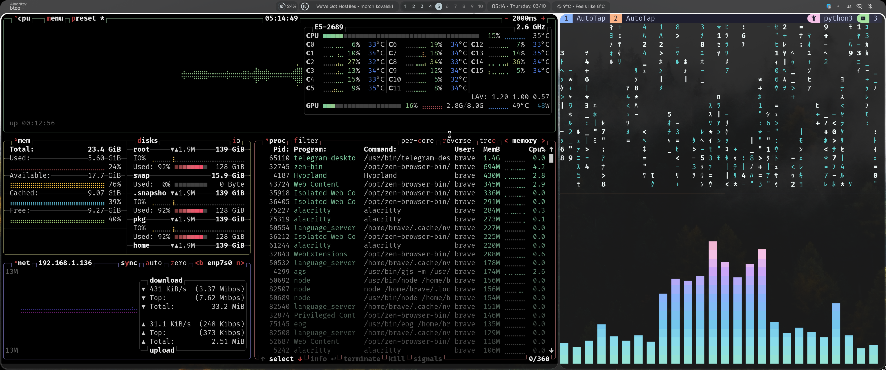

# Brave's dotfiles

**Warning**: Don’t blindly use my settings unless you know what that entails. Use at your own risk!

## Contents

- vim (NeoVim) config
- tmux config
- hyprland config
- fish config

## Neovim setup

Requires [Neovim](https://neovim.io/) (>= 0.9)
Requires [NVChad](https://nvchad.com/) (latest)

## Shell setup (macOS & Linux)

- [Nerd fonts](https://github.com/ryanoasis/nerd-fonts) - Powerline-patched fonts. I use Hack.

## How to use

# stow {name_of_tool}

# for example:

`stow fish`
`stow nvim`

other way: copy .config -> your local ~/.config, fix bugs)

## About me

- [Telegram @bravecode](https://t.me/bravecode)
